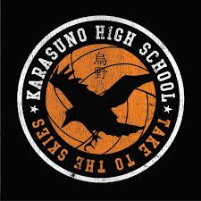

# 🏐 Karasuno Players

<p align="center">
  
</p>

<h3 align="center">
  Projeto Web desenvolvido para avaliação acadêmica
</h3>

<p align="center">
  
  
  
  
</p>

---

## 📖 Sobre o projeto

**Karasuno Players** é um projeto Web desenvolvido como parte de uma **atividade avaliativa da graduação em Engenharia de Software**.

O projeto tem como tema o **Karasuno High School**, equipe de vôlei apresentada no anime e mangá *Haikyuu!!*, utilizando seus personagens como conteúdo principal da interface.

A proposta foi desenvolver uma página Web utilizando **HTML, CSS e JavaScript**, colocando em prática conceitos de estruturação, estilização, responsividade e interatividade.

---

## 🎯 Objetivo

O principal objetivo do projeto foi aplicar, na prática, os conhecimentos adquiridos durante os estudos de desenvolvimento Web.

Entre os conceitos trabalhados estão:

* Estruturação de páginas com HTML5;
* Estilização utilizando CSS3;
* Desenvolvimento de elementos interativos com JavaScript;
* Organização de conteúdo;
* Manipulação e apresentação de imagens;
* Criação de layouts responsivos;
* Desenvolvimento de componentes visuais;
* Organização de arquivos e código.

---

## ✨ Funcionalidades

O projeto conta com diferentes elementos de interação e apresentação de conteúdo, incluindo:

### 🏐 Personagens

Apresentação dos jogadores e personagens relacionados ao time de Karasuno, utilizando imagens individuais para cada personagem.

### 🖼️ Galeria / Slides

Exibição de imagens através de uma apresentação visual com controles de navegação.

### 📂 Janelas de conteúdo

Elementos de interface utilizados para apresentar informações sem deixar a página visualmente sobrecarregada.

### ☰ Menu

Menu de navegação para facilitar o acesso às diferentes áreas da página.

### 🔎 Elementos de interface

O projeto também utiliza elementos visuais como:

* Ícones;
* Botões;
* Imagens;
* Efeitos de `hover`;
* Campos e elementos de navegação;
* Seções organizadas em colunas.

### 📱 Responsividade

Foram utilizadas **Media Queries** no CSS para adaptar a interface a diferentes resoluções de tela.

---

## 🛠️ Tecnologias utilizadas

| Tecnologia        | Aplicação                                |
| ----------------- | ---------------------------------------- |
| 🟠 **HTML5**      | Estrutura e organização do conteúdo      |
| 🔵 **CSS3**       | Layout, estilização e responsividade     |
| 🟡 **JavaScript** | Interatividade e comportamento da página |
| 🖼️ **PNG / JPG** | Imagens e elementos visuais              |

---

## 📂 Estrutura do projeto

```text
karasunoplayers/
│
├── 📄 index.html
├── 📄 main.js
├── 📄 style.css
├── 📄 LICENSE
├── 📄 Readme.md
│
└── 📁 img/
    ├── Icon_Asahi.png
    ├── Icon_Daichi.png
    ├── Icon_Ennoshita.png
    ├── Icon_Kei.png
    ├── Icon_Kinoshita.jpg
    ├── Icon_Narita.png
    ├── Icon_Shoyo.png
    ├── Icon_Suga.png
    ├── Icon_Tadashi.png
    ├── Icon_Tanaka.png
    ├── Icon_Tobio.png
    ├── Icon_Yu.png
    ├── logo.karasuno.png
    ├── lupa.png
    └── perfil.eu.jpg
```

---

## 💻 Como executar

Por ser um projeto Web estático, não é necessário instalar dependências para visualizar a aplicação.

### 1. Clone o repositório

```bash
git clone https://github.com/SkYantS28/karasunoplayers.git
```

### 2. Entre na pasta

```bash
cd karasunoplayers
```

### 3. Abra o projeto

Abra o arquivo:

```text
index.html
```

diretamente no navegador.

> 💡 Para uma experiência de desenvolvimento mais prática, o projeto também pode ser executado utilizando a extensão **Live Server** no Visual Studio Code.

---

## 🎨 Desenvolvimento

O projeto foi desenvolvido buscando combinar **estrutura, funcionalidade e identidade visual**, utilizando os personagens e elementos do universo de *Haikyuu!!* como referência para a construção da interface.

A organização foi dividida principalmente entre:

```text
HTML       → Estrutura
CSS        → Aparência e responsividade
JavaScript → Interatividade
IMG        → Recursos visuais
```

Essa separação permite manter cada parte do projeto organizada e facilita futuras alterações e melhorias.

---

## 📚 Projeto acadêmico

Este projeto foi desenvolvido no contexto da graduação em:

**Engenharia de Software**
**Universidade de Vassouras — Campus Maricá**

📌 **Tipo:** Projeto / atividade avaliativa acadêmica
📌 **Área:** Desenvolvimento Web
📌 **Tema:** Karasuno Players

---

## 👩‍💻 Autora

### Sky Crizosti

Estudante de **Engenharia de Software**, com interesse em desenvolvimento de software, interfaces, tecnologia e Inteligência Artificial.

---

## 🏐 Sobre o tema

O projeto utiliza como inspiração o **Karasuno High School**, equipe de vôlei do universo de *Haikyuu!!*.

Os personagens presentes na aplicação são representados através dos arquivos de imagem armazenados na pasta `img/`.

---

<p align="center">
  🏐 <strong>Karasuno Players</strong>
  <br>
  <sub>Projeto acadêmico desenvolvido durante a graduação em Engenharia de Software.</sub>
</p>
